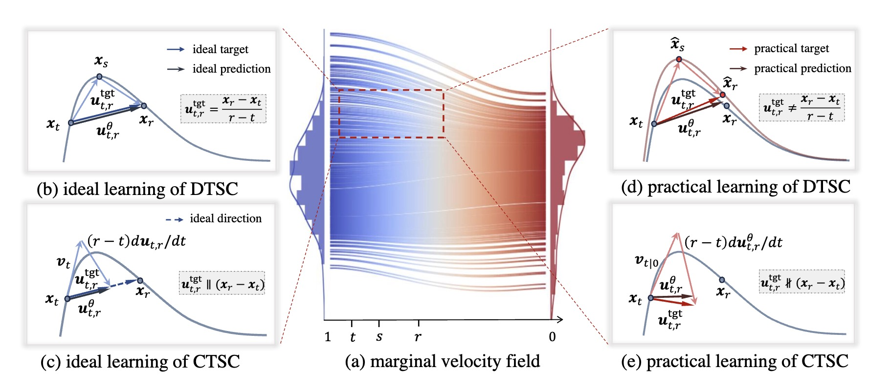

# On the Design of One-step Diffusion via Shortcutting Flow Paths

### *(ESC: ExplicitShortCut)*
[](https://edapinenut.github.io/explicitshortcut-project-page/)
[](https://arxiv.org/abs/2512.11831)
[](https://huggingface.co/Delcher/ESC-XL2/tree/main)
[](https://huggingface.co/Delcher/ESC-B2)
[](https://huggingface.co/papers/2512.11831)


<div align="center">
  <a href="https://https://edapinenut.github.io/" target="_blank">Haitao&nbsp;Lin</a><sup>1</sup> &ensp; <b>&middot;</b> &ensp;
  <a href="https://peiyannn.github.io" target="_blank">Peiyan&nbsp;Hu</a><sup>1,2</sup> &ensp; <b>&middot;</b> &ensp;
  <a href="https://openreview.net/profile?id=~Minsi_Ren1" target="_blank">Minsi&nbsp;Ren</a><sup>1</sup> &ensp; <b>&middot;</b> &ensp;
  <a href="https://cn.linkedin.com/in/zhifeng-gao-30070088" target="_blank">Zhifeng&nbsp;Gao</a><sup>3</sup>
  <br>
  <a href="http://homepage.amss.ac.cn/research/homePage/8eb59241e2e74d828fb84eec0efadba5/myHomePage.html" target="_blank">Zhi-Ming&nbsp;Ma</a><sup>2</sup> &ensp; <b>&middot;</b> &ensp;
   <a href="https://guolinke.github.io" target="_blank">Guolin&nbsp;Ke</a><sup>3</sup>&ensp; <b>&middot;</b> &ensp;
  <a href="https://tailin.org" target="_blank">Tailin&nbsp;Wu</a><sup>1</sup>&ensp; <b>&middot;</b> &ensp;
  <a href="https://en.westlake.edu.cn/faculty/stan-zq-li.html" target="_blank">Stan Z.&nbsp;Li</a><sup>1</sup><br>
  <sup>1</sup> Westlake University &emsp; <sup>2</sup> Chinese Academy of Sciences &emsp; <sup>3</sup> DP Technology &emsp;
</div>

---
<p align="center">
  
</p>

<b>Summary</b>: We propose Explicit ShortCut (ESC), a framework that provides theoretical justification for the validity of shortcut models and disentangles concrete component-level choices, thereby enabling systematic identification of improvements.
With our proposed improvements, the resulting one-step model achieves a new state-of-the-art FID50k of 2.85 on ImageNet-256×256, and further reaches FID50k of 2.53 with 2× training steps, under the classifier-free guidance setting without pre-training, distillation, or curriculum learning.


---


### Data Preparation
This implementation utilizes LMDB datasets with VAE-encoded latent representations for efficient training. The preprocessing pipeline is a reimplementation of the [MAR](https://github.com/LTH14/mar/blob/main/main_cache.py). 
Once the ImageNet is downloaded in "YOUR/IMAGNET/PATH", 
Run the following to create the LMDB datasets:
```bash
torchrun preprocess_scripts/main_cache_imagenet.py \
--folder_dir "YOUR/IMAGNET/PATH/train"
--target_lmdb "YOUR/DESTINATION/LMDB/PATH"
```


### Training from Scratch
See [./scripts](./scripts/README.md) for detailed training commands.

### Downloading the Checkpoints

We provide pretrained checkpoints for models trained with class-consistent minibatching:

| Models|Iterations (Epochs)| Checkpoint Links | FID-50k |
|-------|------|------| --|
| ESC-XL/2 |1.2M (240) |[Hugging Face/ESC-XL2](https://huggingface.co/Delcher/ESC-XL2/tree/main) | 2.85|
| ESC-XL/2 | 2.4M (480) |[Hugging Face/ESC-XL2](https://huggingface.co/Delcher/ESC-XL2/tree/main) | 2.53|
| ESC-B/2 |600k (240) |[Hugging Face/ESC-B2](https://huggingface.co/Delcher/ESC-B2) | 5.78|

### Training the Baselines
See [./scripts/run_baseline.sh](./scripts/run_baseline.sh)


### Evaluation
For the trained checkpoints, or the downloaded ones (.pt file), we provide a distributed evaluation script for large-scale sampling and quantitative evaluation (FID, IS):

```bash
torchrun --nproc_per_node=8 --nnodes=1 evaluate.py \
    --ckpt "/PATH/TO/THE/CHECKPOINTS" \
    --model "SiT-B/2" \
    --resolution 256 \
    --cfg-scale 1.0 \
    --per-proc-batch-size 128 \
    --num-fid-samples 50000 \
    --sample-dir "./fid_dir" \
    --compute-metrics \
    --num-steps 1 \
    --fid-statistics-file "./fid_stats/adm_in256_stats.npz" \
    --adapt-model
```

If there is any data type problem, it means that the numpy or torch version is not correct, you can run the following instead:
```bash
torchrun --nnodes=1 evaluate.py \
    --ckpt "/PATH/TO/THE/CHECKPOINTS" \
    --model "SiT-B/2" \
    --resolution 256 \
    --cfg-scale 1.0 \
    --per-proc-batch-size 128 \
    --num-fid-samples 50000 \
    --sample-dir "./fid_dir" \
    --compute-metrics \
    --num-steps 1 \
    --fid-statistics-file "./fid_stats/adm_float32_in256_stats.npz" \
    --adapt-model
```

### Acknowledgements

This codebase is built upon [REPA](https://github.com/sihyun-yu/REPA). We thank the authors for their excellent work and open-source contribution.

We also thank  the original MeanFlow implementation: [Gsunshine/MeanFlow](https://github.com/Gsunshine/meanflow), [Gsunshine/py-meanflow](https://github.com/Gsunshine/py-meanflow), and [zhuyu-cs/MeanFlow](https://github.com/zhuyu-cs/MeanFlow) for their PyTorch reimplementation, which helped with early code restructuring.

For [IMM](https://github.com/lumalabs/imm), [sCT](https://github.com/xandergos/sCM-mnist), and [CM](https://github.com/openai/consistency_models), we thanks their (re-)implementation for our further remodularizing.

**If you find our work is helpful to your research, please cite the following:**
```
@inproceedings{lin2025designonestepdiffusionshortcutting,
      title={On the Design of One-step Diffusion via Shortcutting Flow Paths}, 
      author={Haitao Lin and Peiyan Hu and Minsi Ren and Zhifeng Gao and Zhi-Ming Ma and Guolin Ke and Tailin Wu and Stan Z. Li},
      booktitle={The Fourteenth International Conference on Learning Representations},
      year={2026},
      url={https://openreview.net/forum?id=k6q8rRYVQR}
}
```
